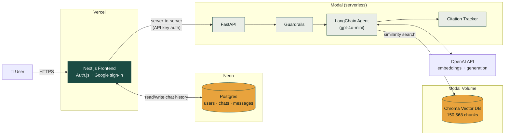

# CleanTech Desk

[](https://clean-tech-agent.vercel.app)
[]([https://clean-tech-agent.vercel.app](https://colab.research.google.com/drive/1GKY15lERbT1t_gq6uoL-WjLLUppMKpWy](https://drive.google.com/file/d/1GKY15lERbT1t_gq6uoL-WjLLUppMKpWy/view?usp=sharing)))
 
**A citation-grounded RAG research assistant for clean technology and climate news — built from scratch through evaluation, guardrails, authentication, and production deployment.**
 
Ask a question about solar, wind, EVs, hydrogen, or climate policy and get an answer traced back to the specific articles it was drawn from — every claim is retrieved from a 20,000+ article archive first, then written with inline `[1][2]` citations you can click through and verify.
 
> Originally built as a final project for CSC 583 (NLP), then taken the rest of the way to a live, authenticated, multi-user product.
 

 
---
 
## What this is
 
CleanTech Desk is a full-stack retrieval-augmented generation (RAG) application:
 
- **The dataset**: 20,111 cleantech/climate news articles, chunked into 150,568 pieces (1,000 chars, 200 overlap).
- **The retrieval**: OpenAI `text-embedding-3-small` embeddings stored in a persisted Chroma vector database.
- **The agent**: a LangChain agent (`gpt-4o-mini`) with three tools — a citation-tracking retriever, a multi-source summarizer, and a bibliography generator — wrapped in input/output guardrails (topic filtering, PII detection, quality checks).
- **The evaluation**: benchmarked with ROUGE-L, BLEU, BERTScore, and an LLM-judge (`gpt-4o`) across 50 held-out queries.
- **The product**: a real web app — Google sign-in, persistent per-user chat history, and a live sources panel — not just a notebook demo.
## Features
 
- 🔍 **Grounded answers** — every factual claim is backed by a retrieved article, cited inline, with the full bibliography a click away
- 🔐 **Google sign-in** — via Auth.js (NextAuth v5), no separate password
- 💬 **Persistent chat history** — every conversation is saved per-user in Postgres and browsable from the sidebar
- 🛡️ **Guardrails** — off-topic questions and inputs containing PII are blocked before they ever reach the model
- 📚 **Live sources panel** — the exact articles behind the current answer, with title, domain, date, and a link to the original
- 🎨 **Editorial design** — built around the fact that the underlying data is literally a news archive, not a generic chatbot skin
## Architecture
 

 
The browser never talks to the RAG backend directly — every chat message goes through the Next.js server first (which handles auth and persistence), which then calls the FastAPI backend server-to-server. The backend itself is stateless per request; all conversation history lives in Postgres, not in the model's context.
 
## Tech stack
 
| Layer | Choice |
|---|---|
| Frontend framework | Next.js 16 (App Router), React 19, TypeScript |
| Styling | Tailwind CSS v4 |
| Auth | Auth.js (NextAuth v5) + Google OAuth |
| Database | Neon (serverless Postgres) + Drizzle ORM |
| Backend API | FastAPI |
| RAG orchestration | LangChain (`create_agent`) + LangGraph |
| Vector store | Chroma |
| Embeddings / LLM | OpenAI `text-embedding-3-small` / `gpt-4o-mini` |
| Backend hosting | Modal (serverless containers) |
| Frontend hosting | Vercel |
 
## Project structure
 
This repo's root is the Next.js frontend. The RAG backend and original notebooks
are included as nested folders for reference and portfolio completeness — the
backend is deployed independently to Modal directly from the `backend/` folder
on disk, not through this repo or Vercel.
 
```
.                                # repo root = the Next.js frontend
├── app/
│   ├── page.tsx                 # Public landing page
│   ├── chat/page.tsx            # Authenticated chat app
│   └── api/                     # Auth.js routes + chat CRUD routes
├── components/                  # ChatApp, ChatMessage, SourcesRail, ChatHistorySidebar, ...
├── db/schema.ts                 # Drizzle schema (users, chats, messages, ...)
├── auth.ts                      # Auth.js configuration
├── package.json
│
├── backend/                     # RAG backend — reference copy; deploys to Modal independently
│   ├── backend.py                # RAG pipeline: retriever, agent, guardrails, citations
│   ├── api.py                    # FastAPI wrapper around backend.py
│   ├── modal_app.py               # Modal deployment config
│   ├── rebuild_vectorstore.py     # Rebuilds chroma_db from the raw dataset if needed
│   ├── test_chroma_load.py        # Standalone sanity check for the vector store
│   └── requirements.txt
│   # chroma_db/ is NOT committed here — it lives in a Modal Volume (~2.3GB)
│
└── notebooks/
    └── CSC_583_NLP_Final_Project.ipynb   # Full pipeline build + evaluation
```
 
## Getting started locally
 
### Prerequisites
 
- Python 3.12+ and Node.js 20+
- An OpenAI API key
- A free [Neon](https://neon.tech) Postgres database
- A Google OAuth client ([Google Cloud Console](https://console.cloud.google.com/apis/credentials))
### Backend
 
```bash
cd backend
python3 -m venv venv && source venv/bin/activate
pip install -r requirements.txt
export OPENAI_API_KEY=sk-...
uvicorn api:app --reload --port 7860
```
 
Visit `http://localhost:7860/docs` to test `/api/chat` directly.
 
### Frontend
 
From the repo root:
 
```bash
cp .env.local.example .env.local   # fill in DATABASE_URL, AUTH_GOOGLE_ID/SECRET, API_URL
npx auth secret                    # generates AUTH_SECRET automatically
npm install
npx drizzle-kit migrate            # creates the Postgres tables
npm run dev
```
 
Visit `http://localhost:3000`.
 
## Deployment
 
- **Backend → Modal**: see `backend/DEPLOY_MODAL.md`. Free tier, no credit card required for initial usage credit; the vector store lives in a persistent Modal Volume so redeploys stay fast.
- **Frontend → Vercel**: see `DEPLOY_FRONTEND.md` (repo root). Push to GitHub, import into Vercel, set the environment variables below, deploy.
### Environment variables (frontend)
 
| Variable | Purpose |
|---|---|
| `DATABASE_URL` | Neon Postgres connection string |
| `AUTH_SECRET` | Auth.js session encryption key |
| `AUTH_GOOGLE_ID` / `AUTH_GOOGLE_SECRET` | Google OAuth client credentials |
| `API_URL` | URL of the deployed FastAPI backend (server-side only, no `NEXT_PUBLIC_` prefix) |
| `BACKEND_API_KEY` | Shared secret so only this frontend can call the backend |
 
## The RAG pipeline in more detail
 
1. **Chunking** — `RecursiveCharacterTextSplitter(chunk_size=1000, chunk_overlap=200)` over the article corpus, producing 150,568 chunks with metadata (title, date, author, URL, domain).
2. **Embedding** — OpenAI `text-embedding-3-small`, stored in a persisted Chroma collection.
3. **Retrieval** — similarity search, `k=5`, per query.
4. **Generation** — a LangChain agent decides between direct retrieval and multi-source summarization, always citing sources inline.
5. **Guardrails** — a keyword/regex-based topic filter blocks off-topic questions before retrieval; an output check catches empty or low-quality responses.
6. **Evaluation** — 50 held-out queries scored on ROUGE-L, BLEU, BERTScore, and an LLM-judge rubric (see `notebooks/CSC_583_NLP_Final_Project.ipynb`, Part III).
### Known limitation
 
The topic guardrail uses simple keyword matching (e.g. `"wind energy"`, `"solar panel"`), which occasionally produces false positives on legitimate questions phrased without those exact phrases (e.g. "what percentage of the world's energy is wind?"). A small classifier-based guardrail would fix this at the cost of one extra LLM call per query — noted here as a deliberate scope decision, not an oversight.
 
## Acknowledgments
 
Built on the CleanTech Media dataset. Originally developed as the CSC 583 NLP final project, then extended with production deployment, authentication, and persistent multi-user chat history.
